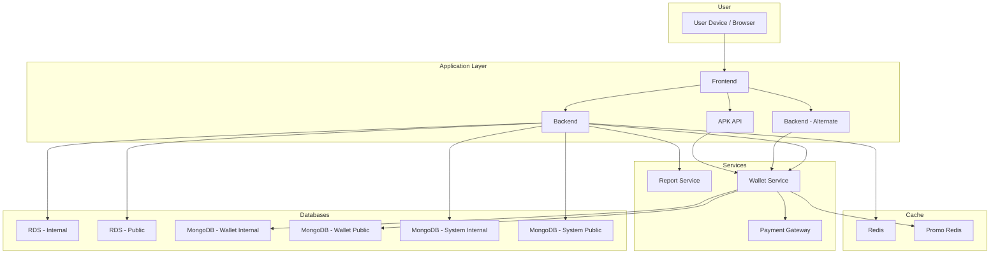

# arch

```mermaid
graph TD

  subgraph User
    U1[User Device / Browser]
  end

  subgraph Application Layer
    FE[Frontend]
    BE[Backend]
    BEA[Backend - Alternate]
    APK[APK API]
  end

  subgraph Services
    REP[Report Service]
    WAL[Wallet Service]
    PAY[Payment Gateway]
  end

  subgraph Databases
    RDSI[RDS - Internal]
    RDSP[RDS - Public]
    MWI[MongoDB - Wallet Internal]
    MWP[MongoDB - Wallet Public]
    MSI[MongoDB - System Internal]
    MSP[MongoDB - System Public]
  end

  subgraph Cache
    RED[Redis]
    PRED[Promo Redis]
  end

  %% Connections
  U1 --> FE
  FE --> BE
  FE --> BEA
  FE --> APK
  BE --> WAL
  BEA --> WAL
  APK --> WAL
  WAL --> PAY
  BE --> REP
  BE --> RDSI
  BE --> RDSP
  WAL --> MWI
  WAL --> MWP
  BE --> MSI
  BE --> MSP
  BE --> RED
  WAL --> PRED

```
